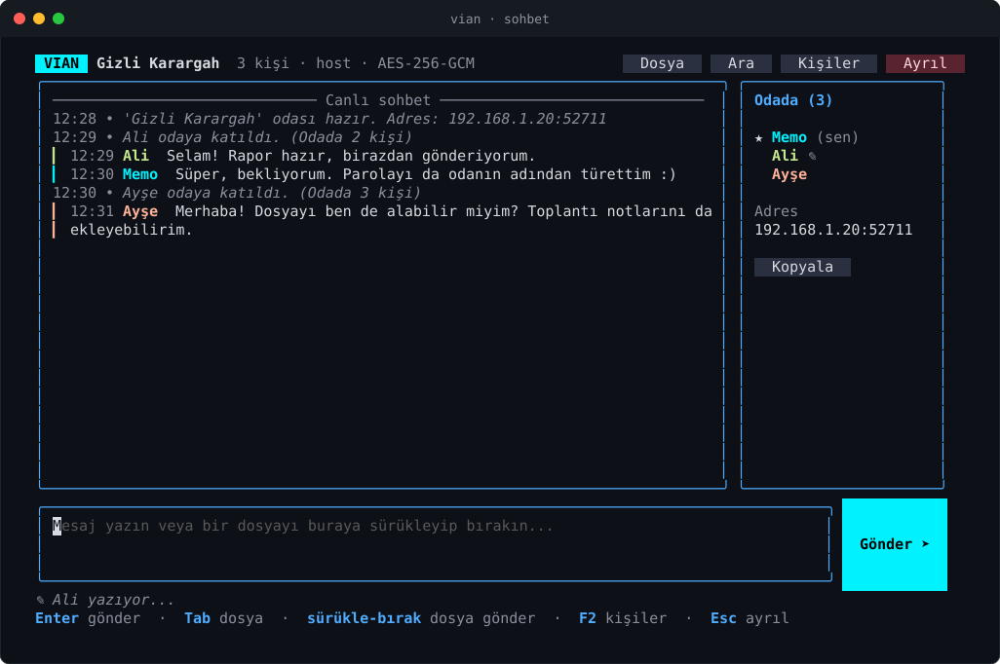
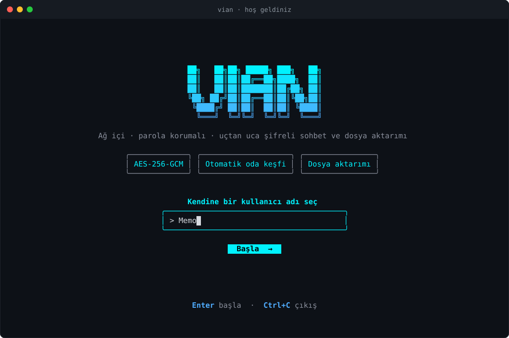
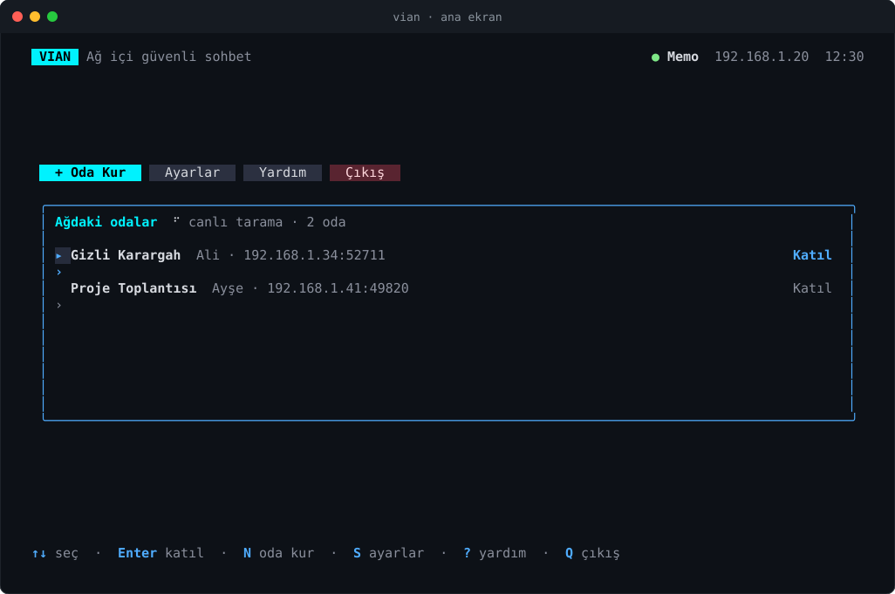
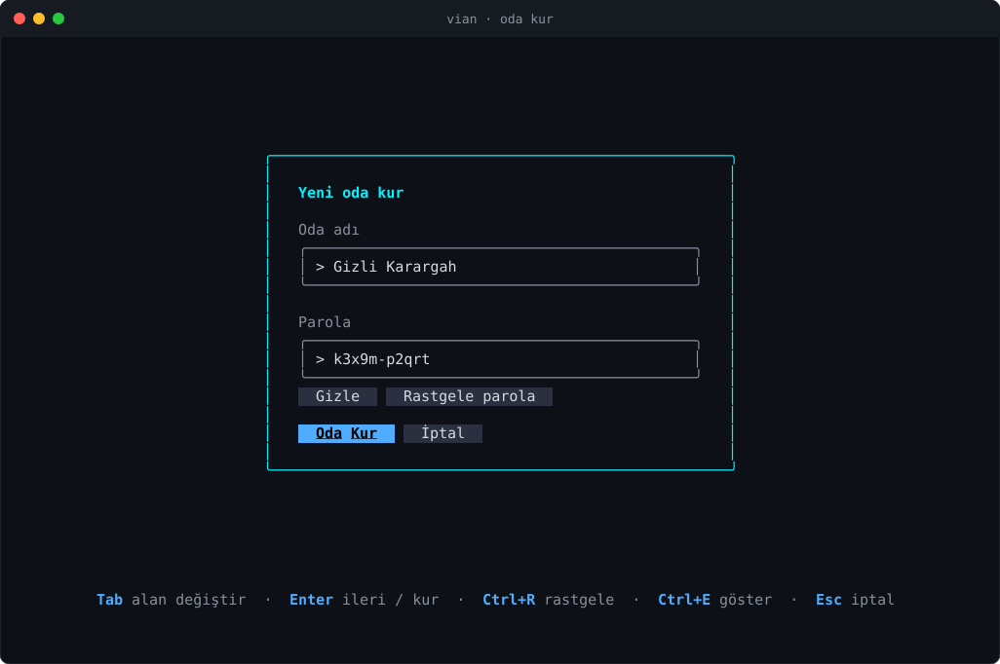
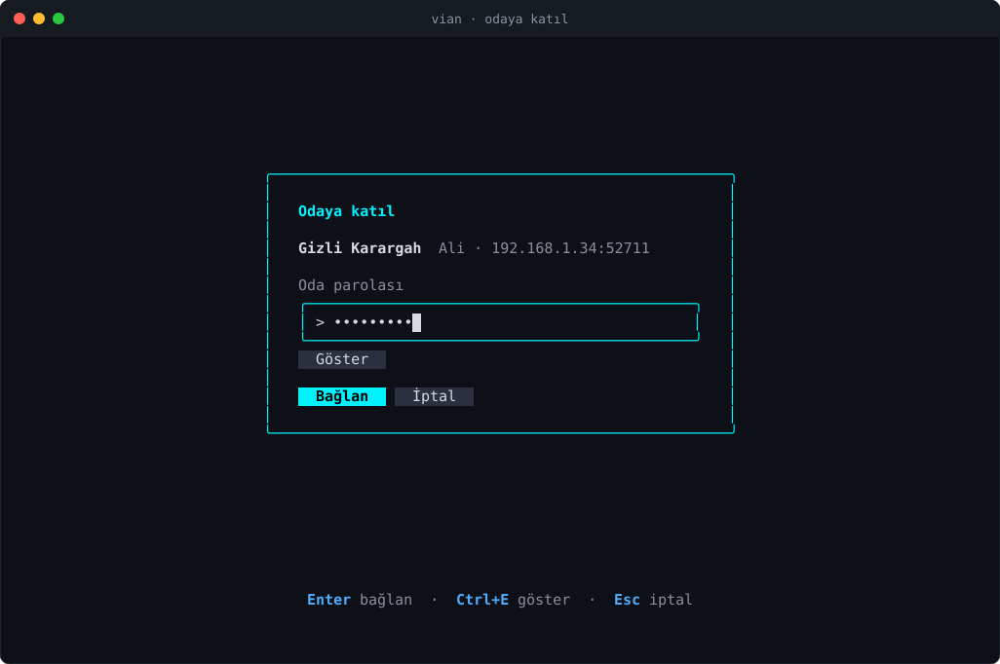
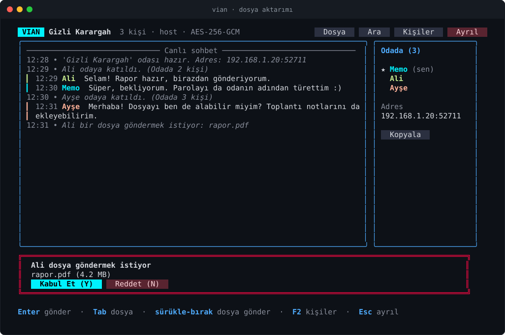
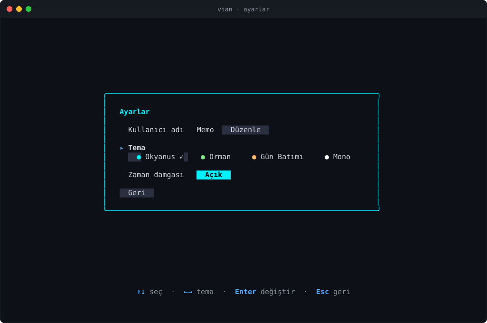
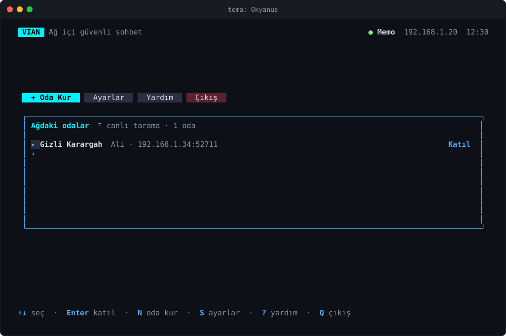
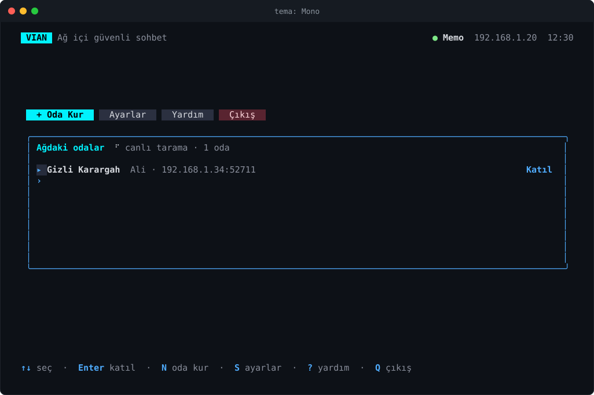

<div align="center">

# VIAN

**Ağ içi, parola korumalı, şifreli sohbet ve dosya aktarımı: tamamı terminalde.**

Sunucu yok, hesap yok, internet gerekmiyor. Aynı ağdaki insanlar odalarını kendiliğinden bulur, parolayla bağlanır ve konuşur.



</div>

---

## Özellikler

| | |
|---|---|
| **Canlı oda keşfi** | Aynı ağda kurulan odalar listede kendiliğinden belirir, kapananlar kendiliğinden kalkar. IP yazmak gerekmez. |
| **Şifreli iletişim** | AES-256-GCM. Anahtar, tuzlu PBKDF2-SHA256 ile parolandan türetilir; trafik her oda için rastgele bir oturum anahtarıyla şifrelenir. |
| **Grup sohbeti** | Tek odada birden çok kişi. Kişi paneli, "yazıyor..." göstergesi, katılma/ayrılma bildirimleri. |
| **Dosya aktarımı** | Sürükle-bırak veya dosya seçici. Alıcı onaylar, ilerleme çubuğu gösterilir, her dosyanın SHA-256 özeti alıcıda doğrulanır. |
| **Fareyle kullanım** | Tüm butonlar tıklanır, üzerine gelince renk değiştirir; tekerlekle kaydırılır. Klavyeyle de tamamen kullanılır. |
| **Geçmiş ve arama** | Mesajlar yerel SQLite veritabanında tutulur, `/ara` ile odanın geçmişinde aranır. |
| **Temalar** | Dört renk teması, ayarlar kalıcıdır. |

## Ekran görüntüleri

<table>
<tr>
<td width="50%"><b>Karşılama</b><br></td>
<td width="50%"><b>Ana ekran: canlı oda listesi</b><br></td>
</tr>
<tr>
<td><b>Oda kur</b><br></td>
<td><b>Odaya katıl</b><br></td>
</tr>
<tr>
<td><b>Dosya teklifi</b><br></td>
<td><b>Ayarlar</b><br></td>
</tr>
</table>

### Temalar

<table>
<tr>
<td></td>
<td></td>
</tr>
<tr>
<td></td>
<td></td>
</tr>
</table>

> Görseller, uygulamanın gerçek ekran çıktısından otomatik üretilir (bkz. [Görselleri yenileme](#görselleri-yenileme)). Örneklerdeki adresler ve isimler uydurmadır.

## Kurulum

Go 1.26 veya üzeri gerekir. Başka bir şey gerekmez, SQLite sürücüsü saf Go'dur (CGO yok).

```bash
git clone https://github.com/mhmtemnbgr1/vian.git
cd vian
go build -o vian.exe .
```

Ya da derlemeden çalıştırmak için:

```bash
go run .
```

Windows Terminal veya farklı bir modern terminal önerilir (renk ve fare desteği için).

## Kullanım

1. **İlk açılış:** Bir kullanıcı adı seçin. Bir daha sorulmaz, **Ayarlar**'dan değiştirebilirsiniz.
2. **Oda kurmak için:** `+ Oda Kur` → oda adı ve parola. **Rastgele parola** butonu okunması kolay bir parola üretir. Parolayı odaya katılacak kişilere kendiniz iletin.
3. **Odaya katılmak için:** Ana ekrandaki **Ağdaki odalar** listesinden odayı seçin (tıklayın veya ↑↓ + Enter), parolayı girin.
4. **Dosya göndermek için:** Dosyayı terminal penceresine sürükleyip bırakın, ya da `Dosya` butonu / `Tab` ile seçiciyi açın. Karşı taraf kabul edince aktarım başlar.

### Klavye ve komutlar

| Ana ekran | |
|---|---|
| `N` | yeni oda kur |
| `↑ ↓` / `Enter` | oda seç / katıl |
| `S` · `?` · `Q` | ayarlar · yardım · çıkış |

| Sohbet | |
|---|---|
| `Enter` | mesajı gönder |
| `Tab` · `/file` | dosya seçiciyi aç |
| sürükle-bırak · `/send <yol>` | dosya gönder |
| `/ara <kelime>` | odanın geçmişinde ara |
| `/users` · `/clear` · `/help` | kişiler · ekranı temizle · yardım |
| `F2` | kişi panelini aç/kapat |
| `PgUp` `PgDn` / tekerlek | geçmişte kaydır |
| `Y` / `N` | gelen dosyayı kabul / reddet |
| `Esc` | odadan ayrıl (onay sorar) |
| `Ctrl+C` | uygulamadan çık |

> Fare yakalama açık olduğu için terminalde metin seçmek istediğinizde **Shift** tuşuna basılı tutarak seçin.

### Komut satırı seçenekleri

| Seçenek | Varsayılan | Açıklama |
|---|---|---|
| `--veri-dizini` | `veri` | veritabanı ve ayarların klasörü |
| `--indirilenler` | `indirilenler` | alınan dosyaların klasörü |
| `--gonderilecekler` | `gönderilecekler` | dosya seçicinin açıldığı klasör |
| `--port` | `0` (rastgele) | oda kurarken kullanılacak TCP portu |
| `--kesif-portu` | `8888` | oda keşfi UDP portu (herkeste aynı olmalı) |

Aynı bilgisayarda iki kopyayı denemek için ikincisini ayrı klasörlerle açın:

```bash
./vian.exe --veri-dizini veri2 --indirilenler indirilenler2
```

## Güvenlik modeli

Ne sağladığı ve sağlamadığı konusunda açık olmak gerekir.

**Sağladıkları**
- Trafik **AES-256-GCM** ile şifrelenir ve doğrulanır (kurcalanan paketler reddedilir).
- Parola anahtarı, oda başına rastgele tuzla **PBKDF2-SHA256 (200.000 tur)** ile türetilir.
- Parola doğrulandıktan sonra host, her oda için rastgele bir **oturum anahtarı** verir; sohbet bu anahtarla şifrelenir.
- Yanlış parolayla bağlanan taraf hiçbir şey öğrenemez, bağlantı sessizce kapanır.
- Host, mesajlardaki gönderen adını kendi bildiği bağlantıdan yazar; biri başkası adına mesaj gönderemez.
- Gelen dosya adlarındaki klasör bileşenleri atılır, yalnızca kabul edilmiş aktarımların parçaları yazılır, her dosya SHA-256 ile doğrulanır.
- Paket boyutu sınırlıdır, el sıkışmanın zaman aşımı vardır.

**Sağlamadıkları**
- Odanın adı, kuranın adı ve tuz, keşif için **şifresiz yayınlanır** (yerel ağdaki herkes görebilir).
- Zayıf bir parola, el sıkışmayı kaydeden birinin çevrimdışı deneme saldırısına açıktır. Uzun/rastgele parola kullanın.
- Oturum anahtarı parola anahtarıyla taşındığı için, bir konuşmanın kaydı tutulduysa ve parola **sonradan** ele geçirildiyse konuşma çözülebilir (ileri gizlilik yoktur).
- Kimlik doğrulama yalnızca parola bilgisine dayanır; kullanıcı adları doğrulanmaz.
- Yalnızca yerel ağ içindir; internet üzerinden bağlantı için tasarlanmamıştır.

## Proje yapısı

```
vian/
├── main.go            giriş noktası
├── cmd/               komut satırı (cobra) ve bayraklar
├── ui/                terminal arayüzü (Bubble Tea + Lip Gloss)
│   ├── menu.go        model, güncelleme mantığı, olaylar
│   ├── view.go        ekranlar, butonlar, temalar
│   ├── settings.go    kalıcı ayarlar ve temalar
│   └── util.go        yardımcılar (sürükle-bırak yol ayrıştırma vb.)
├── network/           TCP bağlantı, el sıkışma, şifreleme, UDP oda keşfi
├── transfer/          dosya teklifi, parçalı gönderim, özet doğrulama
├── database/          SQLite mesaj geçmişi ve arama
└── docs/screenshots/  README görselleri
```

**Kullanılan kütüphaneler:** [Bubble Tea](https://github.com/charmbracelet/bubbletea), [Bubbles](https://github.com/charmbracelet/bubbles), [Lip Gloss](https://github.com/charmbracelet/lipgloss), [bubblezone](https://github.com/lrstanley/bubblezone) (tıklanabilir bölgeler), [Cobra](https://github.com/spf13/cobra), [modernc.org/sqlite](https://pkg.go.dev/modernc.org/sqlite).

## Geliştirme

```bash
go build ./...
go vet ./...
go test ./...
```

Testler şifrelemeyi, el sıkışmayı (doğru ve yanlış parola), mesaj akışını, dosya adı güvenliğini, sürükle-bırak yol ayrıştırmayı ve arayüz akışlarını (fare tıklaması dahil) kapsar.

### Görselleri yenileme

Arayüz değişince README görsellerini yeniden üretin:

```bash
VIAN_SHOTS=1 go test ./ui -run TestGenerateScreenshots
```

PowerShell'de:

```powershell
$env:VIAN_SHOTS = '1'; go test ./ui -run TestGenerateScreenshots
```

## Bilinen sınırlar

- Katılımcılar dosyayı yalnızca host'a gönderebilir; host ise tüm odaya gönderebilir (katılımcıdan katılımcıya aktarım yok).
- Sürükle-bırak, terminal uygulamasının bırakılan dosya yolunu yapıştırmasına dayanır; desteklemeyen terminalde `Tab` ile seçici kullanılır.
- Ağ keşfi UDP yayınına (broadcast) dayanır; yayını engelleyen ağlarda (bazı kurumsal/misafir ağları) odalar listede görünmeyebilir.
